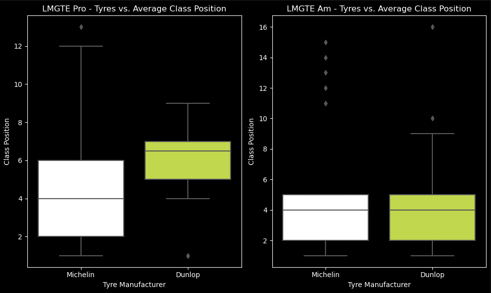
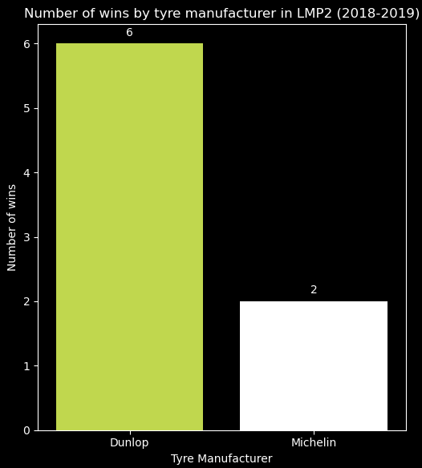
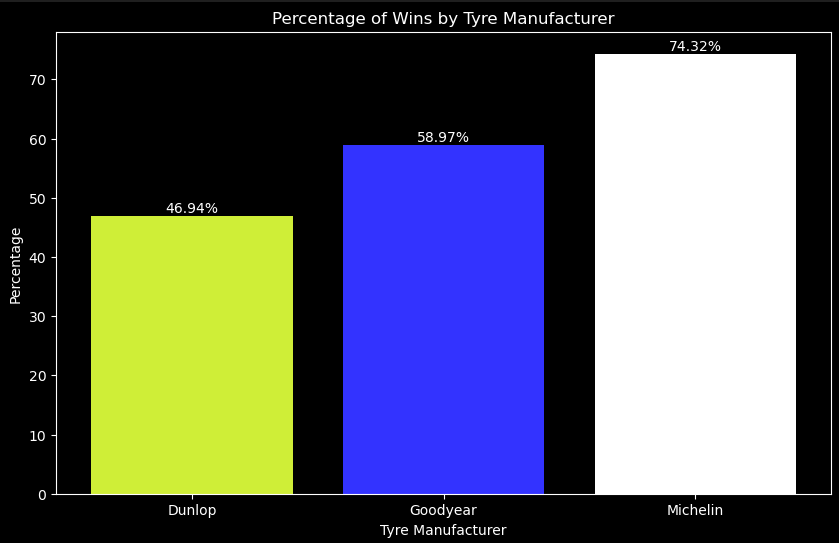
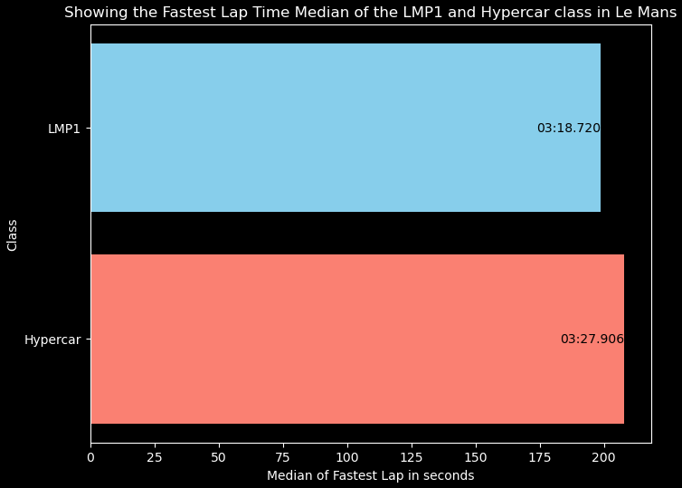
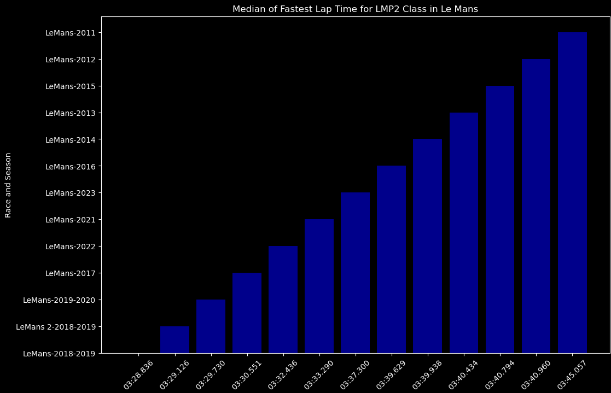
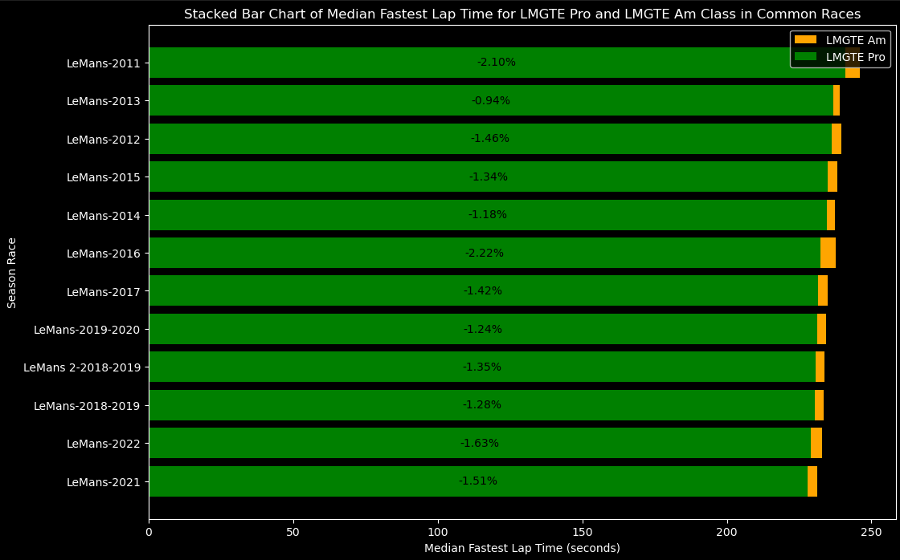

# Inspired by: [Github](https://github.com/JaideepGuntupalli/f1-predictor?tab=readme-ov-file) and [Github](https://github.com/allmeidaapedro/Churn-Prediction-Credit-Card)
&nbsp;
# Dashboard 
&nbsp;
# Project Overview:
In this project, I will perform <b>exploratory data analysis (EDA) on the [FIA WEC season from 2012-2023 and Le Mans 2011 Race](https://www.kaggle.com/datasets/feliperoll/fia-wec-2012-2023-le-mans-2011) database.</b> The main objective here is to test and <b>improve my data analysis</b> and <b>uncover insights to some aspects of Endurance Racing</b>. This will be an ongoing project and may have several updates. I also included the notebook for the dataset creation and the individual datasets used to merge into one.
&nbsp;
# Code and Resources used:
* Python (Pandas, Matplotlib, Seaborn), 
* Jupyter Notebook, Git and Github (version control), 
* Visual Studio Code (project development environment).
&nbsp;
# Data Cleaning steps:
* Renamed values like 'LM P1' to 'LMP1' so we a pattern between the classes
* Dropped Columns that we will not use such as driver names
* Created Columns to help in later analysis
* Filled missing values
* Dropped duplicated values
&nbsp;
# Data Collection & Exploratory Data Analysis:
* Data was collected mainly from https://www.fiawec.com/en/past-seasons/36 and http://fiawec.alkamelsystems.com/index.php, and merged togheter in the wec_database_creation notebook
* The Exploratory Data Analysis took form in the following steps:
   - Looking at the performance of Michelin and Dunlop at the 2017 Season on both LMGTE classes
   &nbsp;

   
   &nbsp;

   - Looking at the performance of Michelin and Dunlop at the 2019-2019 Season on the LMP2 class
      &nbsp;
     
   
   &nbsp;

   - Comparing each tyre manufacturer number of wins with their possible number of wins
      &nbsp;
     
   
   &nbsp;

   - Comparing the difference of performance for the LMP1 class era and the Hypercar class era
      &nbsp;
     
   
   &nbsp;

   - Comparing the LMP2 class troughout the seasons
      &nbsp;
     
   
   &nbsp;

   - Comparing both LMGTE classes performance troughout the seasons
      &nbsp;
     
   

&nbsp;
# Run this project on your local machine
&nbsp;
# Dataset Link: [Kaggle](https://www.kaggle.com/datasets/feliperoll/fia-wec-2012-2023-le-mans-2011)
&nbsp;
# Developed by: 
  * [Felipe Roll - Linkedin](https://www.linkedin.com/in/felipe-roll)
  * [Felipe Roll - Github](https://github.com/FelipeLRoll)
  * [Felipe Roll - Gmail](felipelroll@gmail.com)

    

  

  

